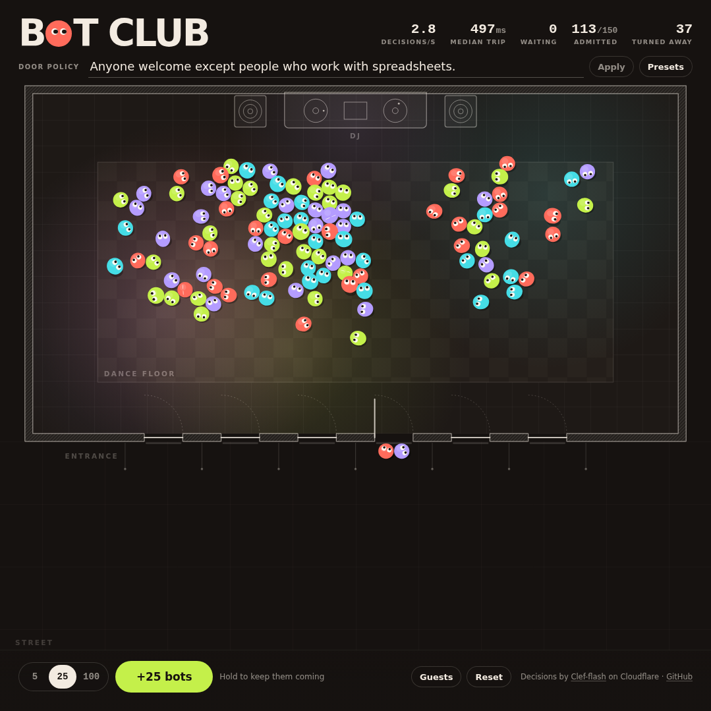

# Bot Club

A tiny top-down nightclub. You write the door policy, then send bots to the door. Cloudflare's
[Clef-flash](https://developers.cloudflare.com/workers-ai/models/clef-flash/) model checks each one.
Admitted bots go through the door and join the dance floor. Rejected bots bounce off and walk away.

Choose **Custom rule**, write any rule (3–140 characters), then **Apply** or press Enter.
Presets are optional starting points; you can edit those too.
Color rules use each bot's visible body color: red/coral, green/lime,
purple/lavender, or blue/cyan/turquoise. For example, "Only green dots" or "No purple bots."

[Play Bot Club](https://bot-club.jadu.workers.dev) · [Download the square demo](https://bot-club.jadu.workers.dev/demo/bot-club-square.mp4)



Every verdict comes from a real model call. There is no local fallback: if the model can't be
reached, the bot is marked as failed and you can retry it. The model can be wrong, and the app
shows whatever it decided. The default rule, "No humans. Everyone else is welcome.", gives a lively
mixed floor; stricter rules like the Monsters preset are a fun way to see where it gets things wrong.

## How it works

- **One bot per request.** The browser sends at most 6 requests at a time, one for each door.
  Each request carries the door policy and a single generated profile (name, species, job, item, intro, color).
  The renderer and the model use the same profile color; color is not inferred from species or items.
- **The rule is locked when the request starts.** Changing the policy only affects bots whose
  request hasn't been sent yet. The guest card shows the rule each bot was judged by.
- **The Worker decides what the model sees.** `POST /api/admit` checks the input and asks
  `@cf/cloudflare/clef-flash` one fixed `choice` question (`admit` or `reject`). It returns
  the model's choice, its per-option probabilities, its separate `confidence` field (which is
  not the same as the chosen option's probability), and the AI call time. Callers can't choose
  the model, the question, or send images.
- **Animation doesn't wait on the network.** The canvas runs its own physics loop. The guest
  card and list show the verdict as soon as it arrives; the bot then acts it out at its door.
  "Admitted" counts permission granted, so a bot may still be walking in.
- **Two different timings.** *AI call* is how long the Worker waited on the Workers AI binding.
  That includes binding and service overhead, not just model inference. *Round trip* is
  measured in the browser from sending the request to reading the response.
- **Metrics only count successes.** Decisions per second (rolling 10 s) and median round trip
  (last 100) leave out failed requests. Turned-away is a running total for the current night.

### Limits

| | |
|---|---|
| Door policy | 3–140 characters |
| Profile fields | name/species ≤ 40, job/item ≤ 48, intro ≤ 160 |
| Profile color | Required: `red`, `green`, `purple`, or `blue`. Older open tabs need a refresh. |
| Request body | ≤ 2 KB, JSON only, same-origin only |
| Concurrency | 6 requests per tab |
| Club / line | 150 admitted, 100 in line (Reset starts a new night) |
| Rate limit | About 120 requests per 10 s per IP (Workers rate limiting binding). Counted per Cloudflare location and eventually consistent, so it slows a noisy client but is not a global spend cap. If the limiter itself errors, the Worker fails closed with a retryable 503. |
| Model timeout | 15 s in the Worker, 25 s in the browser |

### Errors

| Status | Code | Browser behaviour |
|---|---|---|
| 429 | `rate_limited` | Pauses the whole line for `Retry-After` seconds, then sends the same bot again. After 4 waits it gives up. |
| 503 | `upstream_busy`, `limiter_unavailable` | Same as 429. |
| 504 / 502 | `upstream_timeout`, `upstream_error`, `upstream_malformed` | One automatic retry, then the bot is marked failed and you can retry it from its card or the Retry button. |
| 400 / 413 / 415 / 403 | validation | Marked failed, no automatic retry. |

A rejection is a normal result, not an error. Timeouts and failures never show up as rejections.

## Stack

TypeScript, Vite, and plain Canvas 2D in the browser. A Cloudflare Worker serves the static
assets and handles `/api/*` with the Workers AI binding. No frameworks, and no runtime
dependencies beyond the platform.

```
src/        browser: canvas scene, physics, admission queue, UI
shared/     request/response contract and validation used by both sides
worker/     Worker entry, Clef input builder, response parser
test/       Vitest suites for the Worker, the contract, the queue and the layout
public/     favicon, live screenshots, square demo, static headers
```

## Develop

```sh
npm install
npm run check        # typecheck + tests + build
```

The page needs the real API. Running it locally calls Workers AI on your account:

```sh
npx wrangler login
npm run build && npx wrangler dev     # full app on http://localhost:8787
# or, for hot reload, run `npx wrangler dev` and `npm run dev` side by side
```

## Deploy

```sh
CLOUDFLARE_ACCOUNT_ID=<your account id> npm run deploy
```

`npm run deploy` runs the full check first and then `wrangler deploy`. The config needs the
`AI` binding and the `ADMIT_LIMITER` rate limiting binding. No secrets are required.

## License

MIT © Jack
